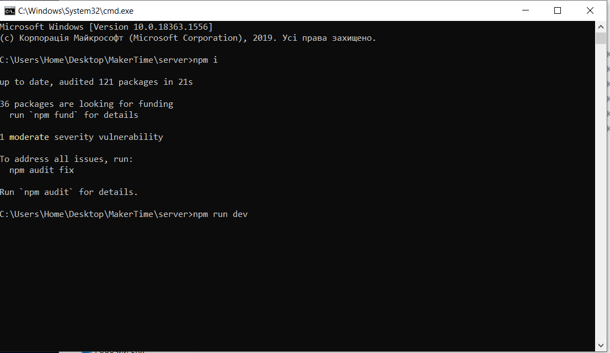
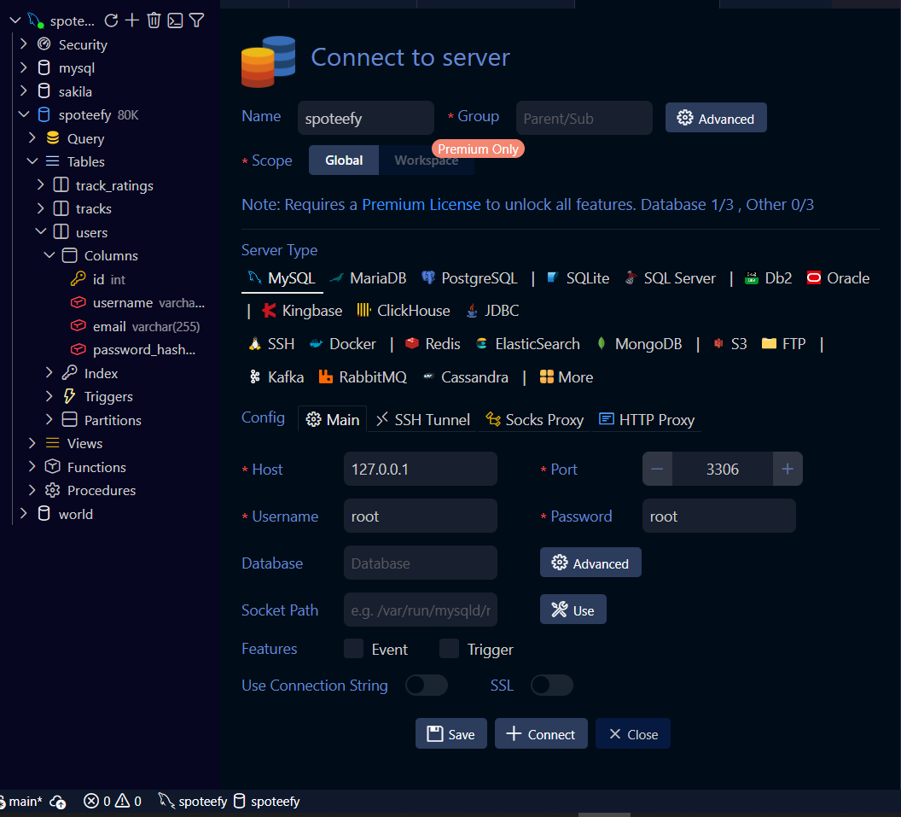
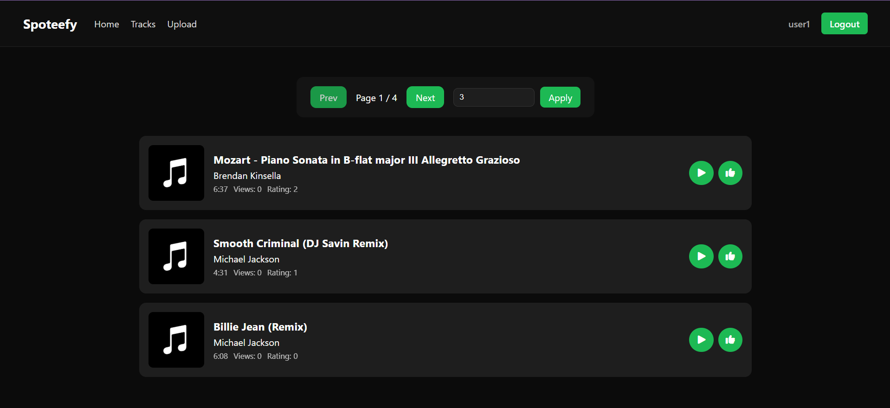
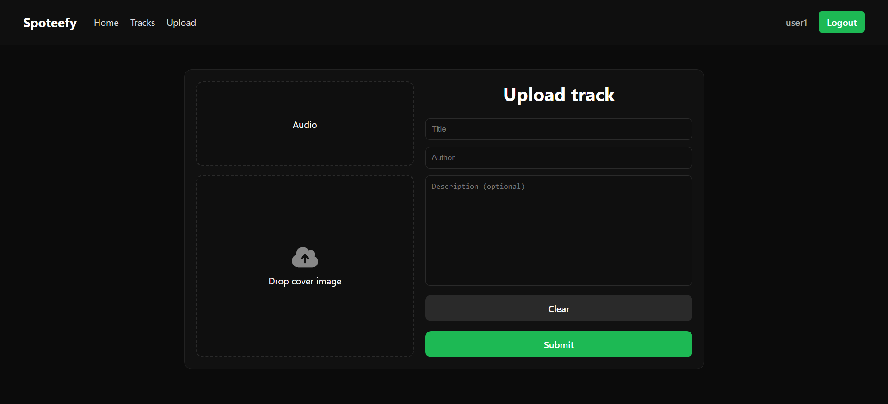
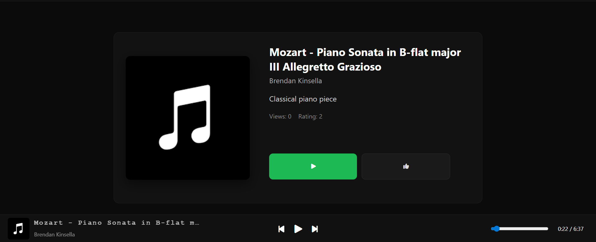
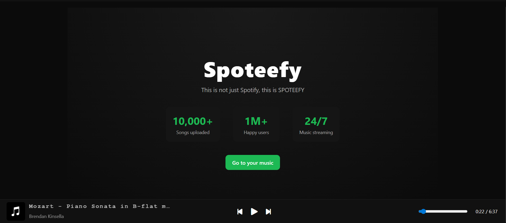

# SPOTEEFY

## Оскільки я не зміг приєднатись, цей readme файл розкаже вам про проект замість мене.
## Налаштування:
Для початку скопіюйте репозиторій на ваш пристрій в будь яку папку:
```
git clone https://github.com/toasting-toasts/SPOTEEFY.git
```
---

Потім відкрийте дві командні строки в папці server та client та пропишіть:
```
npm i
npm run dev        // у папці серверу
npm run dev -- --host // у папці клієнта
```
як показано знизу:



---
## База даних
Після цього потрібно налаштувати базу даних, я залишив `.env` файл з потрібними налаштуваннями, або ж як на картинці:



Знайдіть файл `initial.sql` в папці `/server` та виконайте кожен запит по черзі. Після цього зайдіть на веб-сторінку за адресом `http://localhost:5173`.

---
## Сайт
### Реєстрація
Як тільки ви зайдете на сайт рекомендую увійти на готовий акаунт:

```
user1
password1
```

або самостійно зареєструватись.

---

### Головна сторінка

На головній сторінці знаходиться коротка інформація про сайт та навігація між основними розділами.

---

### Сторінка треків

Саме тут знаходяться всі завантажені композиції.

Для кожного треку відображаються:

* обкладинка;
* назва;
* автор;
* тривалість;
* кількість переглядів;
* кількість вподобань.

Також доступні кнопки:

* відтворення/паузи;
* вподобання треку.

У верхній частині сторінки знаходиться пагінація та налаштування кількості треків на сторінці.



---

### Сторінка завантаження

Для завантаження нового треку перейдіть у розділ **Upload**.

Тут можна:

* вибрати аудіофайл;
* додати обкладинку
(необов'язково, тоді використається стандартна);
* вказати назву;
* вказати автора;
* додати опис.

Обкладинку та аудіофайл можна як вибрати через файловий менеджер, так і перетягнути у відповідні області.

Після успішного завантаження користувача автоматично буде перенаправлено на сторінку треків.



---

### Сторінка окремого треку

При натисканні на картку треку відкривається сторінка з детальною інформацією.

На ній відображаються:

* велика обкладинка;
* назва;
* автор;
* опис;
* кількість переглядів;
* кількість вподобань.

Також доступні кнопки:

* відтворення;
* вподобання композиції.



---

### Аудіоплеєр

У нижній частині сторінки розташований аудіоплеєр.

Він дозволяє:

* переглядати поточний трек;
* ставити музику на паузу;
* продовжувати відтворення;
* перемотувати композицію;
* переходити на початок треку;
* переходити до наступної композиції.

Перегляд треку зараховується після повного прослуховування композиції.



---

## Використані технології

### Frontend

* React
* React Router
* React Context
* SCSS

### Backend

* Node.js
* Express
* JWT
* Multer
* MySQL2
* Bcrypt

### База даних

* MySQL

---

## Реалізований функціонал

* Реєстрація та авторизація користувачів
* JWT-аутентифікація
* Завантаження аудіофайлів
* Завантаження обкладинок
* Стрімінг аудіо
* Підрахунок переглядів
* Система вподобань
* Захист від повторного вподобання одного треку тим самим користувачем
* Пагінація
* Адаптивний інтерфейс
* Глобальний аудіоплеєр

---

Дякую за перегляд проєкту.
У ході виконання проекту майже не було використано генеративного штучного інтелекту.